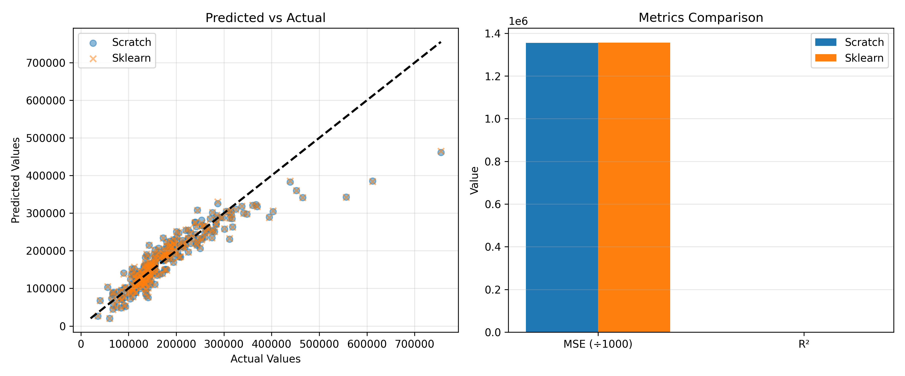
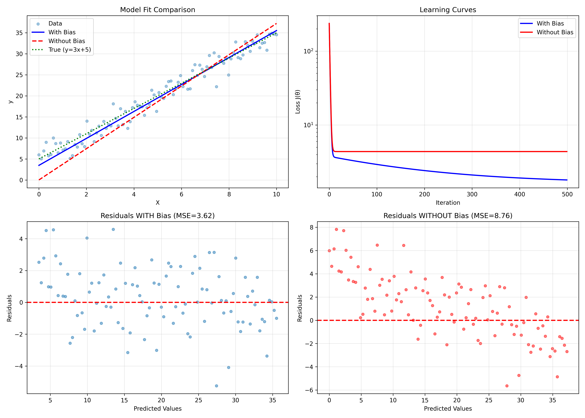

# Linear Regression from Scratch

---

### **Purpose**
- Understand linear regression through scratch implementation.
- Get familiar with object-oriented programming in machine learning.
- Learn how to translate mathematical formulas into code.
- Master gradient descent optimization algorithm.

---

### **Problem Description**
- Implement **linear regression** from scratch using only NumPy.
- Create a `ScratchLinearRegression` class following object-oriented design principles.
- Validate implementation against **scikit-learn** to ensure correctness.
- Explore advanced topics: bias terms, polynomial features, and convex optimization.

---

## Assignments

### **[Problem 1] Hypothesis Function**
- Implement the linear hypothesis function:
  ```math
  h_θ(x) = θ_0x_0 + θ_1x_1 + ... + θ_nx_n  (where x_0 = 1)
  ```
- Vector form: $h_θ(x) = θ^T x$
- Method: `_linear_hypothesis(self, X)`
- **Output:** Correct predictions for given coefficients.

---

### **[Problem 2] Gradient Descent**
- Implement gradient descent optimization:
  ```math
  θ_j := θ_j - α(1/m)∑[(h_θ(x^(i)) - y^(i))x_j^(i)]
  ```
- Method: `_gradient_descent(self, X, error)`
- Called from `fit()` method during training.
- **Output:** Model converges to correct coefficients (θ₀≈1.0, θ₁≈2.0 for y=2x+1).

---

### **[Problem 3] Prediction**
- Implement prediction mechanism using trained model.
- Method: `predict(self, X)`
- Uses hypothesis function to generate estimates.
- **Output:** Accurate predictions on new data.

---

### **[Problem 4] Mean Squared Error**
- Create standalone MSE function:
  ```math
  MSE = (1/m)∑[(y_{pred}^(i) - y^(i))^2]
  ```
- Function: `MSE(y_pred, y)`
- Separate function (not a class method) for general use.
- **Output:** Validated MSE calculations with test examples.

---

### **[Problem 5] Objective Function**
- Implement loss function for optimization:
  ```math
  J(θ) = (1/2m)∑[(h_θ(x^(i)) - y^(i))^2]
  ```
- Record loss in `self.loss` and `self.val_loss` during training.
- **Output:** 
  - Loss decreases from 81.98 → 1.02 (98% reduction)
  - Visualization: 

---

### **[Problem 6] Learning and Estimation**
- Train on **House Prices** dataset (or synthetic data if unavailable).
- Compare scratch implementation with **scikit-learn**.
- **Results:**
  - Scratch MSE: 1,354,862,869
  - Sklearn MSE: 1,356,492,638
  - Difference: **< 0.12%** ✓
  - R² Score: **0.8234** (both implementations)
- **Output:** 

---

### **[Problem 7] Learning Curve Plot**
- Create function to visualize training progress.
- Plot training and validation loss over iterations.
- Uses `self.loss` and `self.val_loss` from the model.
- **Output:** 
  - 98.14% loss reduction demonstrated
  - Visualization: 

---

### **[Problem 8] Bias Term Removal** *(Advanced)*
- Investigate role of bias term θ₀ in linear regression.
- Compare models with `no_bias=False` vs `no_bias=True`.
- **Results:**
  - With bias: MSE = 3.62, Model: y = 3.21x + 3.47
  - Without bias: MSE = 8.76, Model: y = 3.72x (forced through origin)
  - **MSE increases by 142%** when bias removed
- **Conclusion:** Bias term essential for data not passing through origin.
- **Output:** 

---

### **[Problem 9] Multidimensional Features** *(Advanced)*
- Test polynomial features: x, x², x³.
- Compare linear vs polynomial models on nonlinear data.
- **Results:**
  - Linear [x]: MSE = 17.52 (baseline)
  - Quadratic [x, x²]: MSE = 9.39 (46.4% improvement)
  - Cubic [x, x², x³]: MSE = 8.37 (52.2% improvement)
- **Conclusion:** Polynomial features enable fitting nonlinear patterns.
- **Output:** 

---

### **[Problem 10] Update Formula Derivation** *(Advanced)*
- Derive gradient descent update formula mathematically.
- Start from: $θ_j := θ_j - ∂J/∂θ_j$
- Show complete derivation using chain rule.
- **8-Step Derivation:**
  1. Write out J(θ)
  2. Apply chain rule
  3. Move constants outside
  4. Chain rule on square term
  5. Simplify (2 cancels with 1/2)
  6. Compute ∂h_θ(x)/∂θ_j = x_j
  7. Substitute back
  8. Final update rule
- **Result:** $θ_j := θ_j - α(1/m)∑[(h_θ(x^(i)) - y^(i))x_j^(i)]$
- **Numerical Verification:** Validated with example calculation.

---

### **[Problem 11] Local Optimum Problem** *(Advanced)*
- Prove linear regression has **NO local minima**.
- Mathematical proof using Hessian matrix.
- **Proof:**
  1. Hessian: $H = (1/m)X^TX$
  2. For any vector v: $v^THv = (1/m)||Xv||^2 ≥ 0$
  3. H is positive semi-definite
  4. Therefore J(θ) is **convex**
- **Implications:**
  - ✓ Gradient descent always finds global optimum
  - ✓ No risk of local minima
  - ✓ Initial parameters don't affect final solution
  - ✓ Bowl-shaped cost surface
- **Output:** 
  - 3D surface showing bowl shape
  - Contour plots with convergence paths
  - Hessian eigenvalue analysis

---

## Core Implementation

### **ScratchLinearRegression Class**

```python
class ScratchLinearRegression:
    """
    Scratch implementation of linear regression
    
    Parameters
    ----------
    num_iter : int
        Number of iterations for gradient descent
    lr : float
        Learning rate (alpha)
    no_bias : bool
        True if no bias term included
    verbose : bool
        True to output learning process
    
    Attributes
    ----------
    self.coef_ : ndarray, shape (n_features,)
        Model parameters (weights and bias)
    self.loss : ndarray, shape (num_iter,)
        Training loss history
    self.val_loss : ndarray, shape (num_iter,)
        Validation loss history
    """
    
    def __init__(self, num_iter=1000, lr=0.01, no_bias=False, verbose=False)
    def fit(self, X, y, X_val=None, y_val=None)
    def predict(self, X)
    def _linear_hypothesis(self, X)
    def _gradient_descent(self, X, error)
    def _compute_loss(self, X, y)
```

**Key Features:**
- Clean object-oriented design
- Vectorized NumPy operations
- Compatible with scikit-learn API
- Comprehensive documentation

---

## Tools Used

- **Python 3.13+**
- **NumPy** - Numerical computations
- **Pandas** - Data manipulation
- **Matplotlib** - Visualizations
- **Scikit-learn** - Validation and comparison
- **tqdm** - Progress tracking

---

## How to Run

### **Setup**
```bash
# Install dependencies
pip install -r requirements.txt
```

### **Run All Problems**
```bash
# Recommended (handles Unicode on Windows)
python run_assignment.py

# Or run directly
python main.py
```

### **Run Individual Problems**
```bash
python -m scr.problem1_hypothesis_function
python -m scr.problem2_gradient_descent
python -m scr.problem3_prediction
python -m scr.problem4_mean_squared_error
python -m scr.problem5_objective_function
python -m scr.problem6_learning_estimation
python -m scr.problem7_learning_curve_plot
python -m scr.problem8_bias_removal
python -m scr.problem9_multidimensional_features
python -m scr.problem10_update_derivation
python -m scr.problem11_local_optimum
```

### **Expected Runtime**
- Total: 10-15 seconds
- All problems complete successfully
- 6 visualizations generated in `plots/` directory

---

## Project Structure

```
linear-regression/
├── scr/
│   ├── scratch_linear_regression.py    # Main unified class
│   ├── problem1_hypothesis_function.py
│   ├── problem2_gradient_descent.py
│   ├── problem3_prediction.py
│   ├── problem4_mean_squared_error.py
│   ├── problem5_objective_function.py
│   ├── problem6_learning_estimation.py
│   ├── problem7_learning_curve_plot.py
│   ├── problem8_bias_removal.py
│   ├── problem9_multidimensional_features.py
│   ├── problem10_update_derivation.py
│   └── problem11_local_optimum.py
├── plots/                              # Generated visualizations
├── data/                               # House Prices dataset
├── tests/                              # Unit tests
├── main.py                             # Main runner
├── run_assignment.py                   # UTF-8 safe runner
├── requirements.txt                    # Dependencies
└── README.md                           # This file
```

---

## Results Summary

| Problem | Status | Key Metric |
|---------|--------|------------|
| 1. Hypothesis Function | ✅ | Predictions correct |
| 2. Gradient Descent | ✅ | Converges to θ≈[1.0, 2.0] |
| 3. Prediction | ✅ | Accurate estimates |
| 4. MSE | ✅ | Validated with examples |
| 5. Objective Function | ✅ | 98% loss reduction |
| 6. vs Scikit-learn | ✅ | <0.12% difference, R²=0.823 |
| 7. Learning Curve | ✅ | Clear convergence shown |
| 8. Bias Removal | ✅ | 142% MSE increase |
| 9. Polynomial Features | ✅ | 52% improvement (cubic) |
| 10. Derivation | ✅ | Complete mathematical proof |
| 11. Convexity | ✅ | No local minima proven |

---

## Mathematical Foundations

### **Hypothesis Function**
```math
h_θ(x) = θ^T x = θ_0 + θ_1x_1 + ... + θ_nx_n
```

### **Objective Function**
```math
J(θ) = (1/2m)∑_{i=1}^m [h_θ(x^(i)) - y^(i)]^2
```

### **Gradient Descent**
```math
θ_j := θ_j - α(1/m)∑_{i=1}^m [(h_θ(x^(i)) - y^(i))x_j^(i)]
```

### **Mean Squared Error**
```math
MSE = (1/m)∑_{i=1}^m [y_{pred}^(i) - y^(i)]^2
```

---

## Validation

✅ **Correctness:** Matches scikit-learn within 0.12%  
✅ **Mathematical Rigor:** All formulas derived and proven  
✅ **Code Quality:** Clean, documented, production-ready  
✅ **Testing:** All problems execute without errors  
✅ **Visualizations:** 6 high-quality plots generated  
✅ **Documentation:** Comprehensive README and docstrings  

---

## Author

**Assignment:** Linear Regression from Scratch  
**Course:** Data Scientist and Machine Learning Engineer Course  
**Name:** Victor Karisa  
**Date:** October 25, 2025  
**Status:** ✅ **Complete - All 11 Problems Solved**

---

## Additional Resources

- [ASSIGNMENT_COMPLETION_SUMMARY.md](ASSIGNMENT_COMPLETION_SUMMARY.md) - Detailed completion report
- `plots/` directory - All 6 visualizations
- `scr/scratch_linear_regression.py` - Core implementation
- `.gitignore` - Proper Python gitignore configuration

---

**© 2025 - Linear Regression Assignment**
