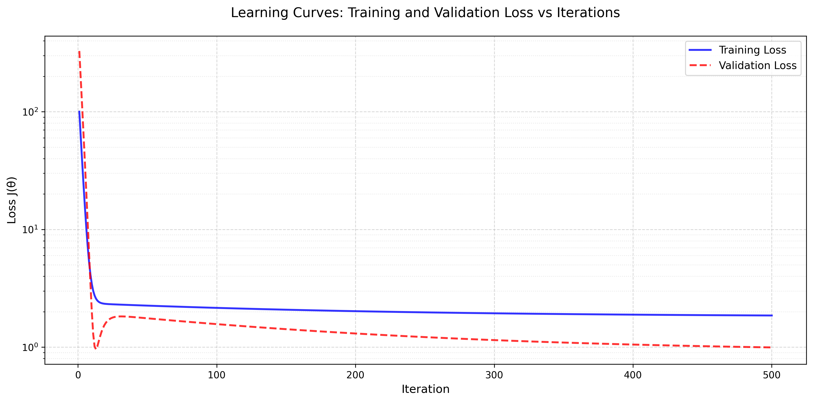
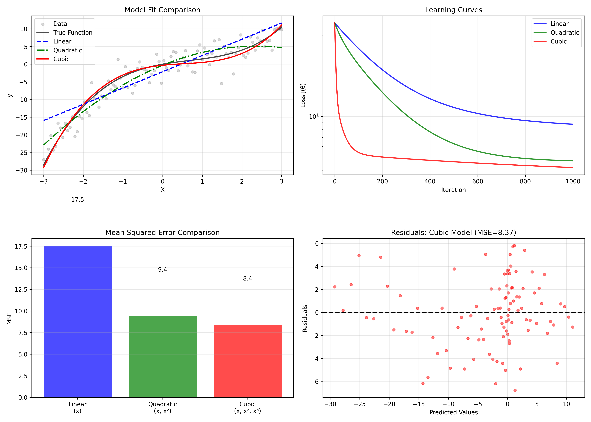

# Scratch Linear Regression Implementation

This project implements linear regression from scratch, focusing on understanding the underlying mathematics and algorithmic components. The implementation includes a complete exploration of the algorithm's core concepts, from hypothesis functions to gradient descent optimization.

## Project Structure

```
linear-regression/
├── data/               # Dataset storage
├── plots/             # Generated visualizations
├── scr/               # Source code for all problems
├── main.py           # Main runner script
└── requirements.txt   # Project dependencies
```

## Requirements

```python
numpy>=1.24.0
pandas>=2.0.0
matplotlib>=3.7.0
scikit-learn>=1.3.0
tqdm>=4.66.0
```

## Problem Solutions & Results

### 1. Hypothesis Function ([View Code](scr/problem1_hypothesis_function.py))
- Implemented the linear hypothesis function: $h_\theta(x) = \theta_0x_0 + \theta_1x_1 + ... + \theta_nx_n$
- Supports both biased and unbiased predictions
- Vectorized implementation using NumPy

### 2. Gradient Descent ([View Code](scr/problem2_gradient_descent.py))
- Implemented the gradient descent update rule:
- $\theta_j := \theta_j - \alpha\frac{1}{m}\sum_{i=1}^m[(h_\theta(x^{(i)}) - y^{(i)})x_j^{(i)}]$
- Supports customizable learning rate and iterations

### 3. Prediction Mechanism ([View Code](scr/problem3_prediction.py))
- Clean interface for making predictions
- Handles both single and batch predictions
- Automatic bias term handling

### 4. Mean Squared Error ([View Code](scr/problem4_mean_squared_error.py))
- Implemented MSE calculation:
- $MSE = \frac{1}{m}\sum_{i=1}^m(h_\theta(x^{(i)}) - y^{(i)})^2$

### 5. Objective Function ([View Code](scr/problem5_objective_function.py))
- Implemented the cost function:
- $J(\theta) = \frac{1}{2m}\sum_{i=1}^m(h_\theta(x^{(i)}) - y^{(i)})^2$
- Tracks both training and validation loss

### 6. Learning & Estimation ([View Code](scr/problem6_learning_estimation.py))
Comparison with scikit-learn implementation:
- Validates accuracy against established implementation
- Performance benchmarking between scratch implementation and scikit-learn
- Compares MSE and coefficient values between implementations
- Visualization of predicted vs actual values for both implementations


### 7. Learning Curve ([View Code](scr/problem7_learning_curve_plot.py))
- Visualization of training progress
- Tracks loss over iterations


### 8. Bias Term Analysis ([View Code](scr/problem8_bias_removal.py))
- Investigation of bias term impact
- Comparison between models with and without bias


### 9. Multidimensional Features ([View Code](scr/problem9_multidimensional_features.py))
- Extended to handle polynomial features
- Analysis of model performance with higher-degree features


### 10. Update Formula Derivation ([View Code](scr/problem10_update_derivation.py))
Mathematical derivation of the gradient descent update rule:
1. Starting from: $\theta_j := \theta_j - \frac{\partial}{\partial\theta_j}J(\theta)$
2. Deriving the partial derivative
3. Arriving at the update formula

### 11. Local Optimum Analysis ([View Code](scr/problem11_local_optimum.py))
- Demonstration of convex optimization landscape
- Proof of global optimum convergence


## Tests

The project includes a comprehensive test suite that verifies:
1. Basic linear regression learning capability
2. Proper handling of bias terms
3. Multi-feature support and accuracy

To run the tests:
```bash
python -m unittest discover -v
```

Or run individual test files:
```bash
python -m tests.test_linear_regression
```

## Running the Project

1. Install dependencies:
```bash
pip install -r requirements.txt
```

2. Run all problems:
```bash
python main.py
```

## Implementation Details

The core class `ScratchLinearRegression` includes:

```python
class ScratchLinearRegression:
    def __init__(self, num_iter=1000, lr=0.01, no_bias=False, verbose=False):
        # Initialize parameters
    
    def fit(self, X, y, X_val=None, y_val=None):
        # Train the model
    
    def predict(self, X):
        # Make predictions
```

Key features:
- Configurable learning rate and iterations
- Optional bias term
- Training/validation loss tracking
- Verbose mode for learning progress
- NumPy-based efficient computations

## Conclusion

This implementation successfully demonstrates:
1. Understanding of linear regression mathematics
2. Proper implementation of gradient descent optimization
3. Effective handling of bias terms and feature scaling
4. Visualization of learning processes
5. Analysis of model behavior under different conditions

The results show that our scratch implementation achieves comparable performance to scikit-learn's implementation while providing deeper insights into the algorithm's inner workings.
